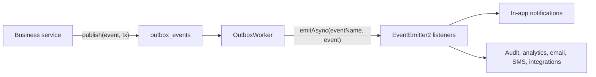

# Durable Domain Events and Notifications

The API uses a transactional outbox with NestJS EventEmitter2 to publish reliable, extensible domain events.

Business services write events to PostgreSQL in the same transaction as their business changes. A scheduled worker later dispatches committed events to independent listeners. This prevents successful business operations from silently losing events during crashes or deployments.

## Architecture



Core locations:

- `src/common/events/`: domain event contract, publisher, outbox repository, worker, and idempotent consumer.
- `src/shared/notifications/`: notification listener, persistence, REST APIs, and SSE.
- `prisma/schema/events.prisma`: outbox, consumer receipt, and notification models.

## Publishing Events

Business services must inject `DomainEventPublisher`. They must not inject `EventEmitter2` directly.

Publish events inside the transaction that commits the corresponding business state:

```ts
await this.prisma.$transaction(async (tx) => {
  const order = await tx.order.create({ data });

  await this.domainEvents.publish(
    createDomainEvent({
      eventName: DOMAIN_EVENTS.orderCreated,
      aggregateType: 'order',
      aggregateId: order.id.toString(),
      actor: { type: 'client', userId: order.userId.toString() },
      payload: {
        orderId: order.id.toString(),
        userId: order.userId.toString(),
        status: order.status,
      },
    }),
    tx,
  );
});
```

Publishing without a transaction client is intentionally unsupported. If the event cannot be stored, the business transaction fails.

### Event Envelope

Every event contains:

| Field           | Purpose                                                  |
| --------------- | -------------------------------------------------------- |
| `eventId`       | Globally unique event identifier used for idempotency.   |
| `eventName`     | Dot-delimited event name, such as `order.created`.       |
| `version`       | Payload contract version, initially `1`.                 |
| `aggregateType` | Entity family, such as `order`, `return`, or `exchange`. |
| `aggregateId`   | Aggregate identifier serialized as a string.             |
| `occurredAt`    | Time the business event occurred.                        |
| `actor`         | Optional actor type and user ID.                         |
| `payload`       | Stable facts and entity IDs required by listeners.       |

Payloads must not contain Prisma models, secrets, verification codes, payment gateway responses, or other unnecessary sensitive data.

## Event Catalog

The currently published event families are:

| Event                          | Published when                                                               |
| ------------------------------ | ---------------------------------------------------------------------------- |
| `order.created`                | A standard or Stripe checkout creates an order.                              |
| `order.status_changed`         | An order moves between normal fulfillment statuses.                          |
| `order.cancelled`              | An order cancellation completes.                                             |
| `payment.completed`            | Payment, refund, or manual payment verification succeeds.                    |
| `payment.failed`               | A payment or refund requires review.                                         |
| `return.requested`             | A client creates a return request.                                           |
| `return.<status>`              | A return is approved, rejected, cancelled, received, refunded, or completed. |
| `exchange.requested`           | A client creates an exchange request.                                        |
| `exchange.<status>`            | An exchange transitions status.                                              |
| `exchange.reservation_expired` | Replacement stock reservation expires.                                       |

Add new stable names to `DOMAIN_EVENTS` where the event is reused across publishers. Dynamic status-transition names remain dot-delimited and must follow the existing aggregate naming convention.

## Adding a Listener

Listeners use `@OnEvent()` and must be idempotent:

```ts
@OnEvent('order.*', { async: true, suppressErrors: false })
handleOrder(event: DomainEvent) {
  return this.consumer.run(event, 'OrderAnalyticsListener', async () => {
    await this.analyticsRepository.recordOrderEvent(event);
  });
}
```

Rules:

- Use a stable, unique consumer name. Renaming it causes previously processed events to run again.
- Wrap durable side effects with `IdempotentEventConsumer.run`.
- Let failures throw. The outbox worker retries the event.
- Use repositories for database access.
- Do not call external providers while holding the original business transaction.

`event_consumer_receipts` records successful consumers using the unique pair `(eventId, consumerName)`.

## Outbox Worker

`OutboxWorker` runs every five seconds:

1. Claims up to 50 pending events using `FOR UPDATE SKIP LOCKED`.
2. Marks claimed events as `processing`.
3. Dispatches each event with `EventEmitter2.emitAsync`.
4. Marks the event `processed` after all listeners succeed.
5. Returns failed events to `pending` with exponential backoff.
6. Marks events `failed` after 10 attempts.

Every ten minutes, it:

- Recovers `processing` events locked for more than ten minutes.
- Deletes processed events older than 30 days.
- Retains failed events for investigation.

Useful operational queries:

```sql
SELECT event_name, status, attempts, last_error, created_at
FROM outbox_events
WHERE status IN ('pending', 'processing', 'failed')
ORDER BY created_at;
```

Retry a failed event after resolving its cause:

```sql
UPDATE outbox_events
SET status = 'pending',
    attempts = 0,
    available_at = NOW(),
    locked_at = NULL,
    last_error = NULL
WHERE event_id = 'EVENT_ID';
```

## In-App Notifications

`DomainNotificationListener` listens to order, payment, return, and exchange events.

- The affected client receives a notification when the payload contains `userId`.
- Active admins receive notifications when their role has `list` or `read` permission for the relevant resource.
- Event-specific title and body translation keys are persisted and localized when read.
- Notification bodies are fully translated messages; internal event names and raw status values are never used as user-facing text.
- Unknown future events use a translated, human-safe general update until a specific notification template is added.
- The unique constraint `(eventId, recipientId, notificationType)` prevents duplicates.
- The notification API exposes `entity` at the response root for client navigation. Related entity IDs remain in `data`, while the primary entity ID is not duplicated.

Example:

```json
{
  "id": "105",
  "type": "return.approved",
  "entity": { "type": "return", "id": "8" },
  "data": {
    "orderId": "42",
    "status": "approved"
  }
}
```

Current REST endpoints exist in both `/client` and `/admin` contexts:

| Method  | Path                                         | Purpose                                          |
| ------- | -------------------------------------------- | ------------------------------------------------ |
| `GET`   | `/notifications?page=1&limit=20&unread=true` | Paginated notification list.                     |
| `GET`   | `/notifications/unread-count`                | Current unread count.                            |
| `PATCH` | `/notifications/:id/read`                    | Mark one owned notification as read.             |
| `PATCH` | `/notifications/read-all`                    | Mark all owned notifications as read.            |
| `GET`   | `/notifications/stream`                      | SSE stream for new notifications and heartbeats. |

The full paths are `/client/notifications/...` and `/admin/notifications/...`.

SSE is an immediate-delivery convenience. REST is the durable recovery source. The current SSE implementation supports a single API instance; multiple instances require shared pub/sub such as Redis.

## Database and Verification

Apply and inspect migrations with Prisma:

```bash
pnpm --filter @ecommerce/api exec prisma migrate deploy
pnpm --filter @ecommerce/api exec prisma migrate status
pnpm --filter @ecommerce/api exec prisma generate
```

Verify the implementation:

```bash
pnpm --filter @ecommerce/api typecheck
pnpm --filter @ecommerce/api build
pnpm --filter @ecommerce/api test -- common/events/domain-events.spec.ts shared/notifications/notification.service.spec.ts --runInBand
```

## Extension Checklist

When adding a new event:

1. Choose a stable dot-delimited event name and payload version.
2. Publish it inside the transaction that commits the business change.
3. Include IDs and stable facts only.
4. Add listeners without changing the publisher.
5. Wrap durable listener effects with `IdempotentEventConsumer`.
6. Add focused tests for transaction forwarding, listener idempotency, retry behavior, and recipient ownership.
7. Update the event catalog in this document.
